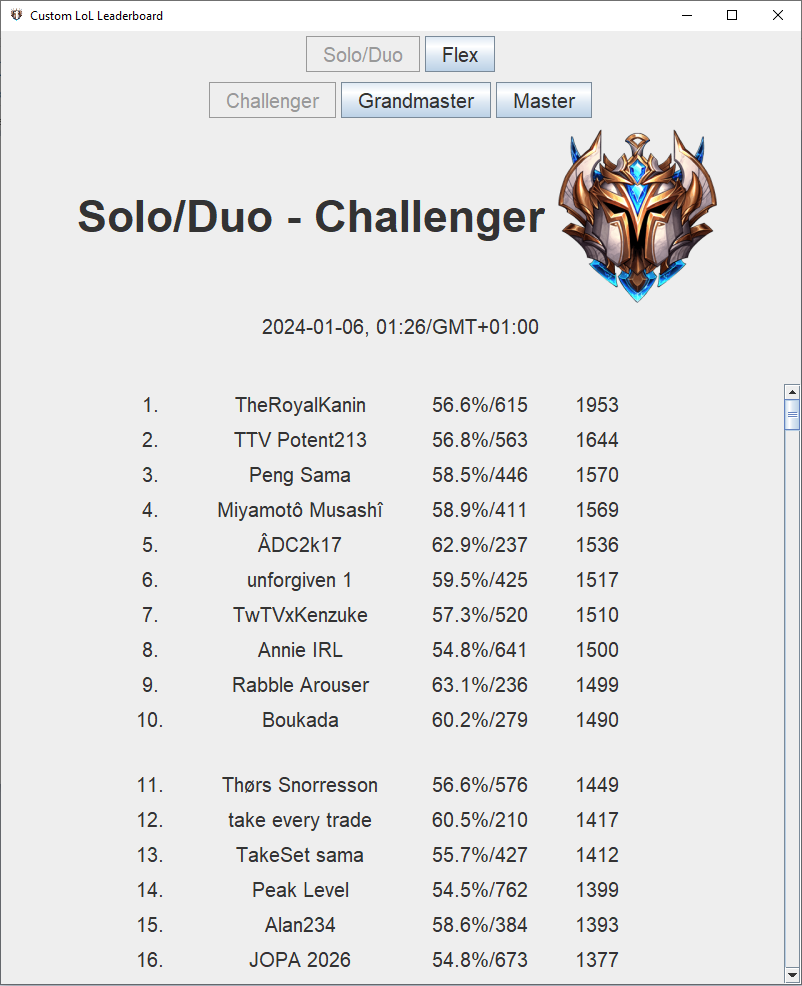
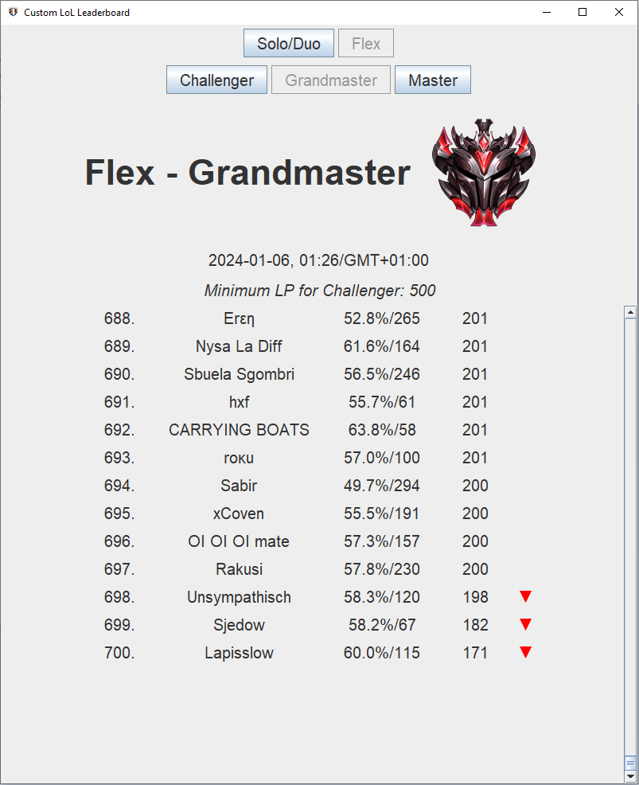

# Custom LoL Leaderboard
This program visualizes the best players (Master, Grandmaster or Challenger) of [League of Legends](https://www.leagueoflegends.com/en-gb/).
Furthermore, the tool is capable of showing which players will promote to Grandmaster/Challenger or demote to Grandmaster/Master.
Also, the tool shows the current LP which has to be exceeded to reach Grandmaster/Challenger.

Such that the program is able to query the [API](https://developer.riotgames.com/apis) of Riot Games, there has to exist an environment variable `RIOT_API_KEY_CUSTOM_LADDER` with the value of a valid API key which can be generated by creating a Riot account at [https://developer.riotgames.com/](https://developer.riotgames.com/).

## Deprecation Notice
Currently, the tool doesn't not work, because Riot Games changed their API such that it is not possible to retrieve the name of each player (only the IDs).
Querying for each summoner ID would exceed the available API limitation.

## Screenshots of example visualizations
First few Solo/Duo Challenger Players:

  

Last few Flex Grandmaster Players:

  

